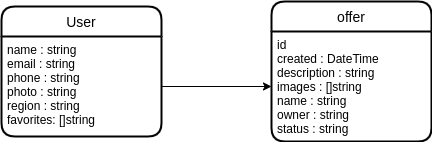

# Expert BG backend
Expert BG's backend is the monitoring system, which lays behind the offer system of the ExpertBG mobile application. It aims at providing an efficient way of monitoring recent and old offers in order to ensure a safe and meaningful 
pool of offers in our application.

### Current status

| Main                                                                                                       | Dev                                                                                                      |
|------------------------------------------------------------------------------------------------------------|----------------------------------------------------------------------------------------------------------|
|  |  |

## Architecture

The backend consists of two main parts - an API, which makes the connection to the Firestore database and a Blazor
webassembly application, which is responsible for displaying the data and user interactions.

## Data model

Data model should be kept consistent across different clients and the single source of truth - Firestore DB.

